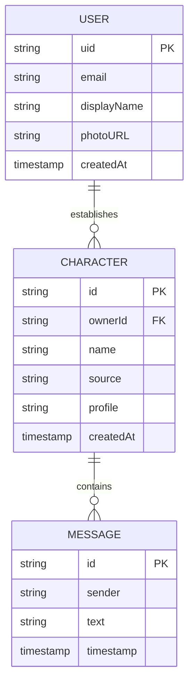

# Entity Relationship Diagram (ERD)

This document describes the data models and their relationships in the IsekAIChat application.

## Entities

### User
Stores information about the authenticated users.

| Field | Type | Description |
|-------|------|-------------|
| uid | string | Unique identifier from Firebase Auth |
| email | string | User's email address |
| displayName | string | User's full name |
| photoURL | string | URL to user's profile picture |
| createdAt | timestamp | When the user first logged in |

### Character
Represents a fictional character that a user has connected with.

| Field | Type | Description |
|-------|------|-------------|
| id | string | Unique identifier for the character |
| ownerId | string | Reference to the User who created the connection |
| name | string | Name of the character |
| source | string | The world/media the character is from (e.g., Konoha, Grand Line) |
| profile | string | The harvested personality profile generated by Gemini |
| createdAt | timestamp | When the connection was established |

### Message
Represents a single message in a chat session. Stored as a sub-collection of a Character.

| Field | Type | Description |
|-------|------|-------------|
| id | string | Unique identifier for the message |
| sender | string | Either "user" or "character" |
| text | string | The content of the message |
| timestamp | timestamp | When the message was sent |

## Relationships

- **User (1) ↔ (N) Character**: A user can establish multiple dimensional links (characters). Each character belongs to exactly one user.
- **Character (1) ↔ (N) Message**: Each character has its own chat history. Messages are stored within the character's document scope.

